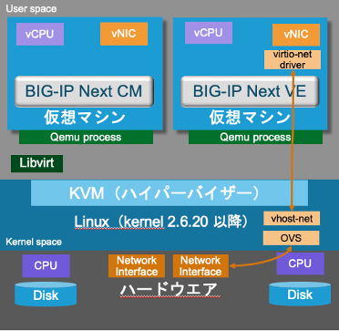

BIG-IP Next と KVM
======================================

KVM (Kernel-based Virtual Machine) は、Linuxカーネルをハイパーバイザーとして機能させるための仮想化テクノロジーです。

KVMでは、ゲストはサーバ上のプロセスによって表されます。これは、ホストの処理能力、メモリー、およびNICなどを使用して、ゲスト(BIG-IP Next CMやVE)の仮想ハードウェアの機能をエミュレーションすることを意味します。

