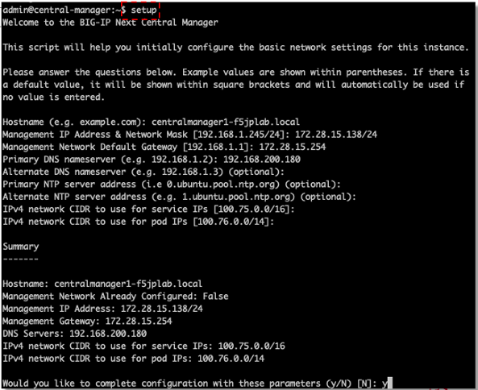
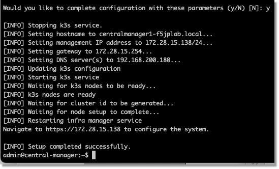
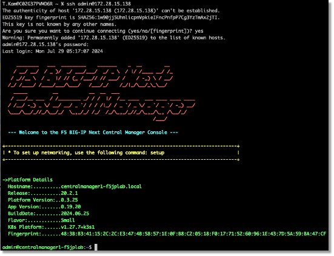
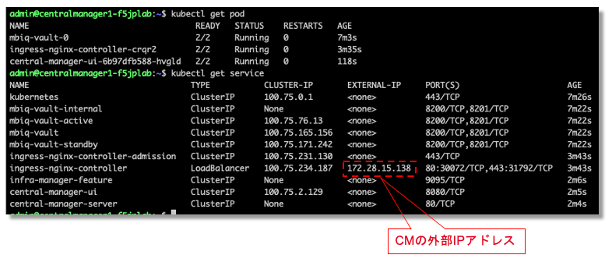

BIG-IP Next Central Manager KVMのネットワークセットアップ
=========================================================

CMコンソールでsetupコマンドを実行して、環境に合わせて以下のネットワーク設定を入力

- ホスト名
- 静的IPアドレスまたはDHCP
- デフォルトゲートウエイ（静的IPアドレスの場合）
- DNSサーバ（静的IPアドレスの場合）
- NTPサーバ
- 内部K8sのserviceとpod用のサブネット（静的IPアドレスの場合）

.. note::
   注記：CMのサービス起動後に上記設定変更は不可能です。

 

|

yを入力してネットワーク設定を適用すると、CMに必要なpodとserviceが起動されます。

|

セットアップ完了後、CMに再度ログインするとこのような画面が表示されます。

|

kubectlコマンドを使用してCMのコアサービスとIPアドレスの確認が可能です。

|

