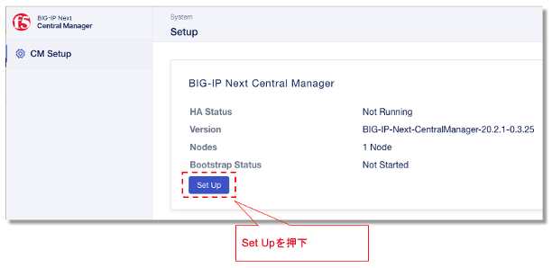
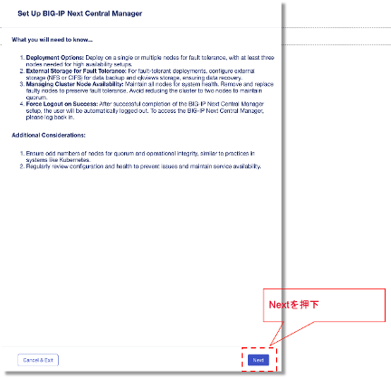
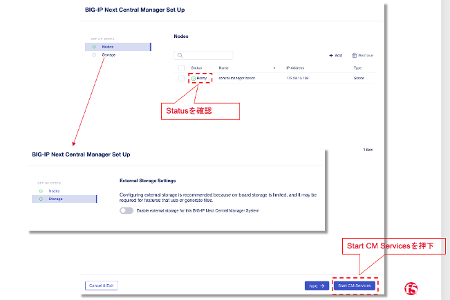
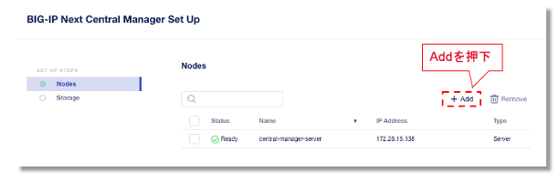
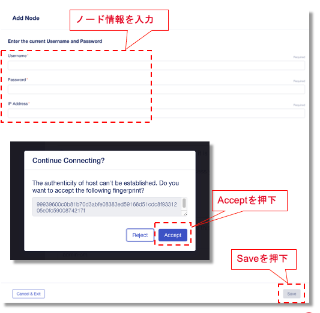
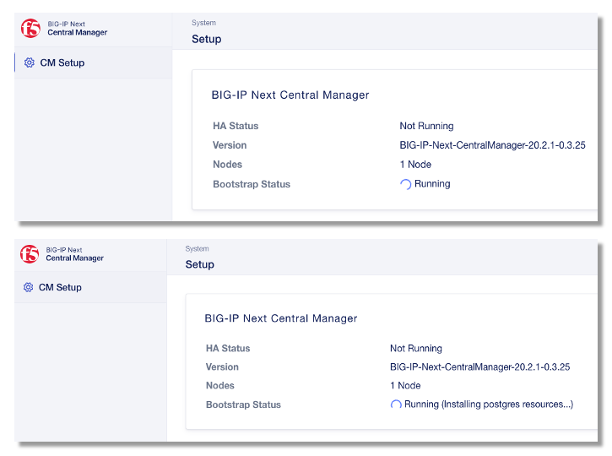
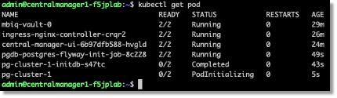
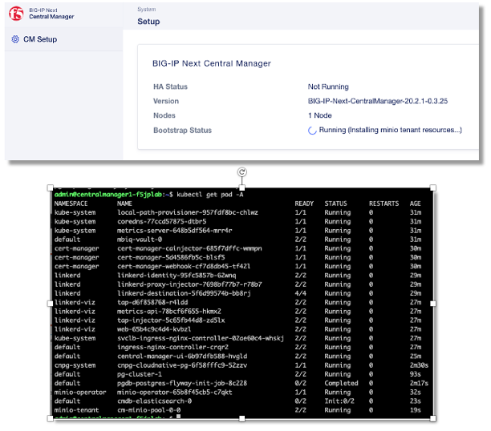
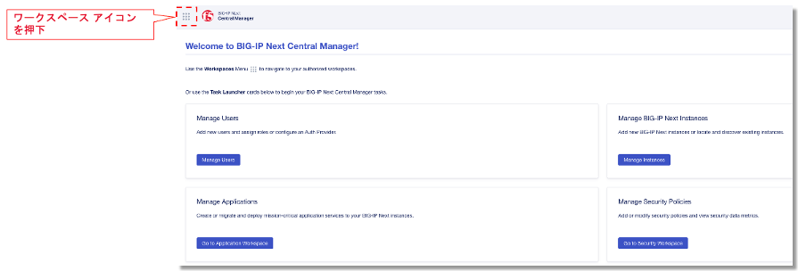
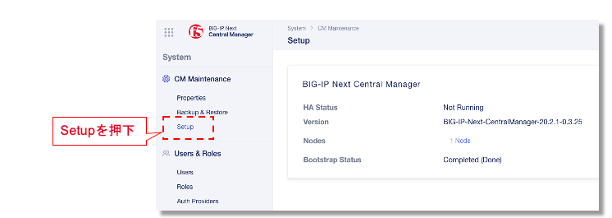

BIG-IP Next Central Manager KVMのGUIでのセットアップ
=========================================================

CMの様々なサービスをインストールするためにSet Upボタンを押下します。

.. note::

   注記: 事前にCLIで行われたsetupスクリプトが完了後に２−３分待ってからこちらのGUIでのSet Upを実施してください。

|

セットアップに必要な情報を確認後にNextを押して続けます。

|

Standalone構成の場合は1台のCMサーバの状態がReadyであることを確認します。

任意: 外部Storage(NFSまたはSAMBA)を設定したい場合はStorageを選択して設定を行います。

Start CM Servicesを押してセットアップを実施

|

High Availability構成の場合は+AddボタンをクリックしてCMノードを追加します。

|

Continue Connecting?という画面にてNodeのFingerprintを確認してAcceptを押下します。

.. note::

   注記: ノードの追加には所要時間は15分程度

|

セットアップ実行中にはこのような画面にて状態の確認が可能です。

|

CMのCLIにてkubectlコマンドでpodの起動状態の確認も可能です。

|

セットアップ実行中にはこのような画面にて状態の確認が可能です。

|

インストール後、BIG-IP Next Central Manager に管理者としてログインし、F5 アイコンの隣にあるワークスペース アイコンをクリックし、

|

システム >> CM Maintenanceをクリックして、Setup画面をクリックすると、Bootstrap Statusが完了と表示されます。

|

