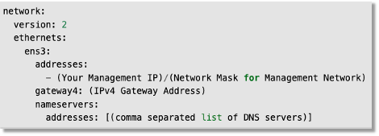
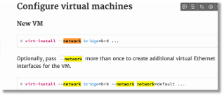

BIG-IP Next VE KVMのネットワーク設定
=========================================================

静的IPアドレスを設定したい場合は以下のようなnetplan形式(yaml)ファイルを作成してIPアドレス情報を定義します。

 

|

複数ネットワークインターフェースを設定する際にvirt-installコマンドに複数--networkオプションを指定して実行します。

 

|

