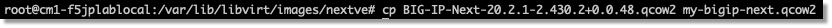

BIG-IP Next VE KVMのイメージ作成
=========================================================

ダウンロードされたイメージを解凍します。

例:

    .. code-block:: bash

        tar -xvf BIG-IP-Next-20.2.1-2.430.2+0.0.48.qcow2.tar.gz

 

|

cpコマンドで新規イメージを作成します。

例:

    .. code-block:: bash

        cp BIG-IP-Next-20.2.1-2.430.2+0.0.48.qcow2.tar.gz my-bigip-next.qcow2

|

cloud-localdsというツールをインストールして事前に作成したnetplanファイルを指定してISOイメージを作成(cloud-localds は、ユーザーデータやメタデータを含むディスクイメージを作成します)

例:

    .. code-block:: bash

        sudo apt install cloud-image-utils

        cloud-localds my-bigip-next.iso -H my-bigip-next -N network.yaml -m local /dev/null

|