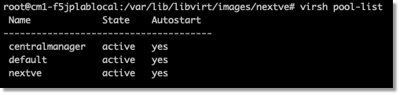
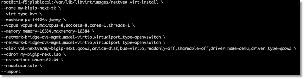
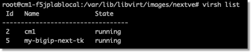

BIG-IP Next VE KVMのインスタンスのデプロイ
=========================================================

/var/lib/libvirt/images配下にNext VE用のフォルダを作成します。

例:

    .. code-block:: bash

        mkdir /var/lib/libvirt/images/nextve

virsh pool-list コマンドにてlibvirt/imagesフォルダ名と同名でstorage poolが作成されていることを確認します。

例:

    .. code-block:: bash

        virsh pool-list

|

.. note::
   注記: イメージ作成・削除を繰り返すとvirsh poolを更新する必要があります。
   
   例:

    .. code-block:: bash

        virsh pool-refresh nextve

virt-install コマンドでインスタンスを起動します。

以下のスクリーンショットでは2つのvirtioのネットワーク・インターフェースを作成するためのコマンドです。

|

以下のようなコマンドでNext VEのqcow2イメージを指定してインスタンスのデプロイを実施します。

    .. code-block:: bash

        virt-install --name my-bigip-next-tk --virt-type kvm --machine pc-i440fx-jammy --vcpus vcpus=8,maxvcpus=8,sockets=8,cores=1,threads=1 --memory memory=16384,maxmemory=16384 --network=bridge=ovs-mgmt,model=virtio,virtualport_type=openvswitch --network=bridge=ovs-mgmt,model=virtio,virtualport_type=openvswitch --disk vol=nextve/my-bigip-next.qcow2,device=disk,bus=virtio,readonly=off,shareable=off,driver_name=qemu,driver_type=qcow2 --cdrom my-bigip-next.iso --os-variant ubuntu22.04 --noautoconsole --import

.. list-table:: オプションの説明
   :widths: 25 50
   :header-rows: 1

   * - オプション名
     - 説明
   * - --noautoconsole
     - ゲスト起動時ホストからゲストにコンソール接続するのを抑制
   * - --noreboot
     - インストール後はVMを停止する
   * - --network
     - ゲストからホストへのネットワーク接続を指定
   * - --disk vol
     - ゲストのディスクイメージファイル(既存のボリューム)を指定
   * - --os-variant 
     - OS細部種類を指定
   * - --import 
     - ボリュームをインポート

virsh listコマンドでインスタンスの状態を確認します。

|

