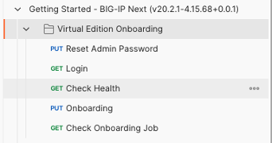

BIG-IP Next VE KVMのインスタンスのOnboarding
=========================================================

Postmanというツールを使用して、BIG-IP Next VEのAPIに対して設定パラメータを送信してonboardingします。

下記URLにてPostmanのcollectionをダウンロードしてPostmanのアプリにインポートします。
 `BIG-IP Next Postman Collection`_  

|       

|       

Postmanアプリの右上にある環境変数アイコンをクリックして、使用するBIG-IP Next IPアドレスやパスワードの値を変更します。

|   

Postman Collectionを開いてonboarding用の項目を確認します。

|   

Reset Admin Password, Login, Check Health, Onboarding, Check Onboarding Jobのリクエストを順番に実行します。

|   

|   

|   

|   

Check Onboarding JobのリクエストのTest Resultsが全てPASSとなっていることを確認します。

|   

|   

PostmanによるOnboarding後、BIG-IP Next Central Manager に管理者としてログインし、F5 アイコンの隣にあるワークスペース アイコンをクリックし、Infrastructure >> Instances >> My Instances画面を表示します。

|   

Start Adding Instancesをクリックして事前に起動したインスタンスのIPアドレスとポートを入力してConnectを押下します。

|   

|   

インスタンスのユーザ名とパスワードを入力します。

|  

Add Instance画面にて新たに管理用のユーザ名とパスーどを入力
(既存に表示されるadmin-cmのユーザ名を使用することを推奨します。)

|  

インスタンスの一元管理を確認するように求められます。 BIG-IP Next Central Manager は、追加している BIG-IP Next インスタンスからローカルに構成されたユーザーをすべて削除します。何らかの理由で、ローカルの BIG-IP Next インスタンスでのユーザーの無効化が失敗した場合、BIG-IP Next インスタンスの BIG-IP Next Central Manager への追加は停止され、ローカルの BIG-IP Next インスタンスですべてのユーザーが再度有効になります。 。この確認ダイアログではAddをクリックする必要があります。

|  

Continue Connecting?という画面にてNodeのFingerprintを確認してAcceptを押下します。

|  

|  

この手順を完了すると、My Instancesのリストに新しいインスタンスが表示されます。

|  

.. _BIG-IP Next Postman Collection: https://clouddocs.f5.com/bigip-next/latest/_downloads/97786c6c678c239863323f200a105b6f/BIG-IP-Next-Postman-Collection-v20.2.1-4.15.68-0.0.1.zip

 

