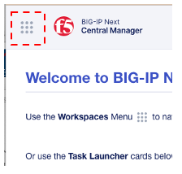
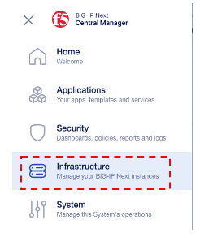
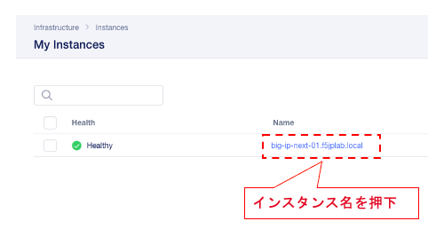
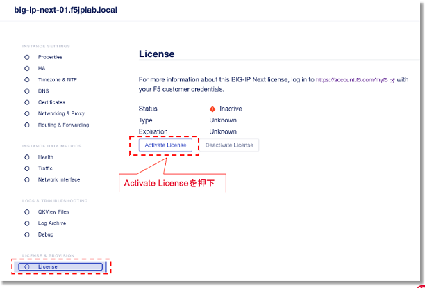
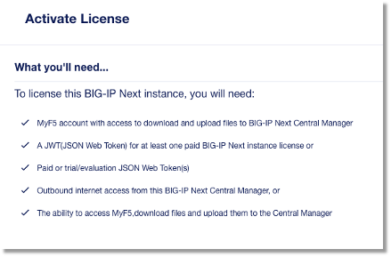
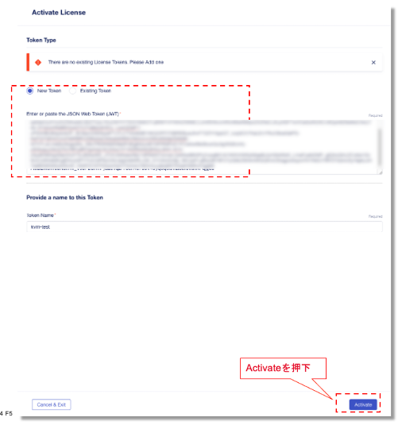
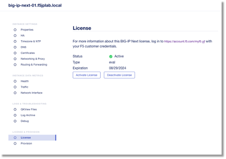

BIG-IP Next VE KVMのインスタンスのLicenseに関して
================================================

本章では、BIG-IP Next VEのライセンスのアクティベーションをします。

F5 アイコンの隣にあるワークスペース アイコンをクリックし、Infrastructure >> Instances >> My Instances画面を表示します。

|       

前に追加したインスタンスの名前をクリックします。

|       

次に、Licenseをクリックします。ステータスが「非アクティブ」になっていることがわかります。

|       

Active Licenseをクリックすると、ライセンス要件の概要が表示されます (ライセンスのアクティブ化ワークフローを初めて実行する場合)。

|       

NextをクリックしてNew Token(JWT)を選択して、トークンの欄にペーストします。

|       

kvm-testという名前を入力します。

Activateをクリックします。

Activate完了後にStatusがActiveと表示されます。

|       