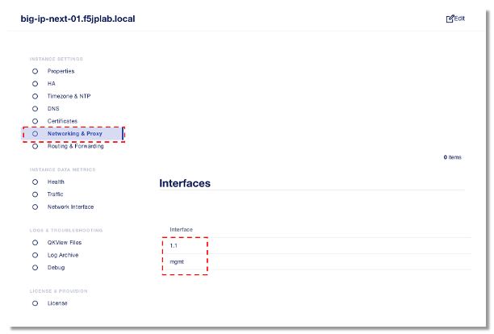
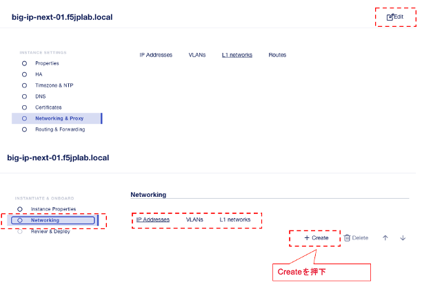
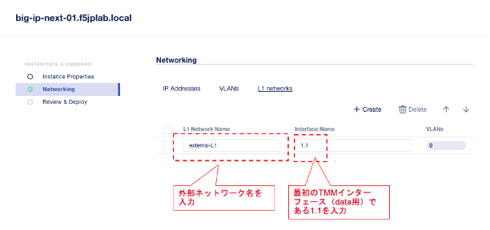
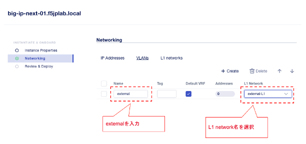
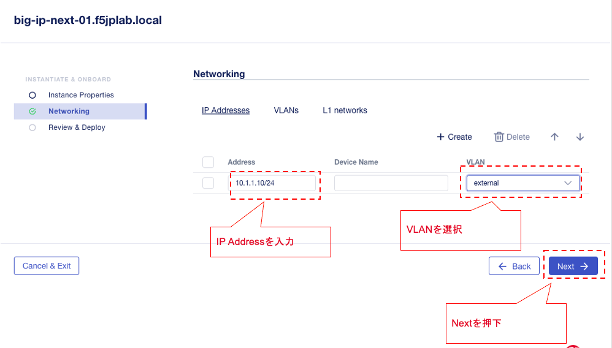
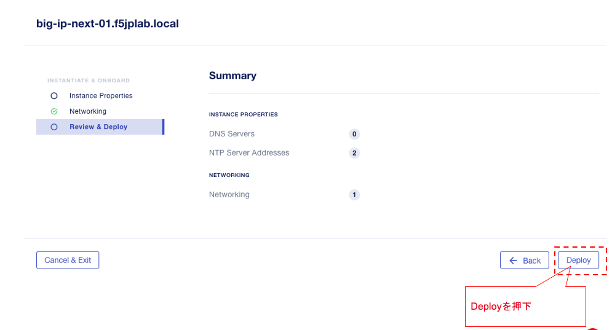

BIG-IP Next VE KVMのネットワーク・インターフェース設定
=========================================================

インスタンスのNetworking & Proxyをクリックするとvirt-installコマンドで定義したインターフェースの確認が可能です。

 

|

外部(dataplane)通信用のインターフェースの設定を行う。

Edit >> Networking

下記の順で設定を入力

#. L1 Networks
#. VLANs
#. IP Addresses

 

|

L1 Networks設定後に、次にVLANs設定に進みます。

|

VLAN設定を入力します。

|

2つ目のネットワークブリッジに所属しているサブネットのIP Addressを入力し、Nextを押下します。

|

最後にDeployを押下します。

|